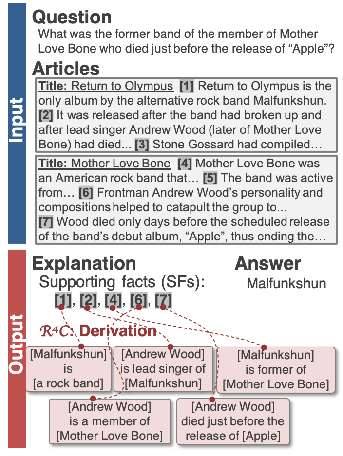

<p align="center">
 <br />
</p>

# About R4C

Recent studies have revealed that reading comprehension (RC) systems learn to exploit annotation artifacts and other biases in current datasets.
This prevents the community from reliably measuring the progress of RC systems.
To address this issue, we introduce R4C, a new task for evaluating RC systems' internal reasoning.
R4C requires giving not only answers but also derivations: explanations that justify predicted answers.

<p align="center">
 <br />
</p>

This website publicly releases the R4C dataset, the first, quality-assured dataset consisting of 4.8k questions, each of which is annotated with 3 reference derivations (i.e. 14.5k derivations).


# Download

[This repository](https://github.com/naoya-i/r4c) contains the R4C corpus and its official evaluation script.


# Leaderboard

## Full prediction setting

|Model|Entity|Relation|Full|
|-|-|-|-|
| Human [1]           | 83.3/81.5/81.6 | 72.2/69.2/69.8 | 77.6/75.0/75.5 |

## Golden supporting facts setting

|Model|Entity|Relation|Full|
|-|-|-|-|
| Human [1]           | 83.3/81.5/81.6 | 72.2/69.2/69.8 | 77.6/75.0/75.5 |
| Baseline (CORE) [1] | 66.1/59.8/61.8 | 50.9/45.9/47.4 | 59.1/53.4/55.1 |
| Baseline (IE) [1]   | 11.1/52.8/16.3 | 13.7/62.7/19.9 | 11.2/51.9/16.3 |

## References

1. Naoya Inoue, Pontus Stenetorp and Kentaro Inui. R4C: A Benchmark for Evaluating RC Systems to Get the Right Answer for the Right Reason. In <i>Proceedings of the 58th Annual Meeting of the Association for Computational Linguistics (ACL2020)</i>, July 2020, to appear.

To list your work here, please contact us about your results and publication.
Before submitting, please make sure the following:

- Use the official evaluation script.
- Report the results on the dev portion of R4C corpus.

We look forward to your results!


# Citation

## Latex code for R4C logo

```
\DeclareMathAlphabet\mathbfcal{OMS}{cmsy}{b}{n}
$\mathbfcal{R}^4\mathbfcal{C}$
```

## Papers
1. Naoya Inoue, Pontus Stenetorp and Kentaro Inui. R4C: A Benchmark for Evaluating RC Systems to Get the Right Answer for the Right Reason. In <i>Proceedings of the 58th Annual Meeting of the Association for Computational Linguistics (ACL2020)</i>, July 2020, to appear.


## Author
[Naoya Inoue](https://naoya-i.github.io)
